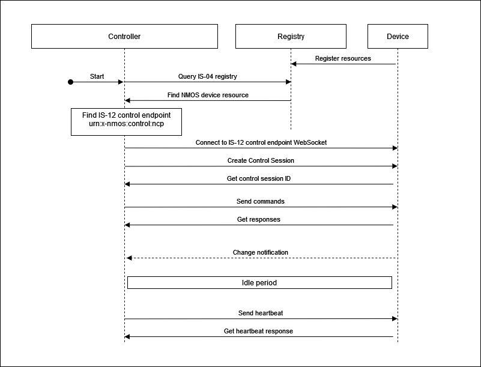
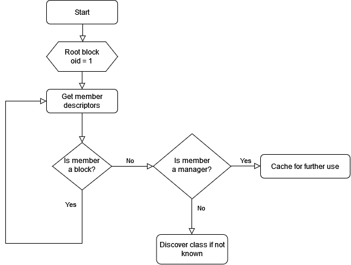

# Controller implementation tutorial

{:.no_toc}

- This will be replaced with a table of contents
{:toc}

This section covers the basis for quickly building an MS-05 / IS-12 controller implementation.

## Guidance

This section provides guidance in select focus areas required for controller implementations.

The basic controller workflow follows the diagram below where individual steps are detailed in the following subsections.

|  |
|:--:|
| _**Basic controller sequence**_ |

### Discovering the device control endpoint (in NMOS IS-04)

The [NMOS IS-12](https://specs.amwa.tv/is-12/branches/v1.0-dev/docs/IS-04_interactions.html) specification explains that the control endpoint is advertised in the controls array as part of the NMOS device resource. The schema for the NMOS device resource is available in the [NMOS IS-04](https://specs.amwa.tv/is-04/branches/v1.3.1/APIs/schemas/with-refs/device.html) specification.

This means that a controller can discover if an NMOS device exposes an NMOS IS-12 control endpoint by checking if the controls array in the NMOS device resource contains the control type of `urn:x-nmos:control:ncp`.

Control endpoint example:

```json
{
  ...
    "senders": [
        ...
    ],
    "receivers": [
        ...
    ],
    "controls": [
        {
            "type": "urn:x-nmos:control:ncp/v1.0",
            "href": "ws://hostname/example"
        }
    ],
    "type": "urn:x-nmos:device:generic",
    "id": "58f6b536-ca4c-43fd-880a-9df2501fc125",
  ...
}
```

The controller can then use the discovered control endpoint to make the initial WebSocket connection which will subsequently be used for NMOS IS-12 parameter control.

### Sending commands and receiving responses

As per the [NMOS IS-12](https://specs.amwa.tv/is-12/branches/v1.0-dev/docs/Protocol_messaging.html#command-message-type) specification a controller can send [Commands](https://specs.amwa.tv/is-12/branches/v1.0-dev/docs/Sending_commands.html) and receive responses.

`Note`: Multiple commands can be sent in the commands array.

As per the [MS-05-02](https://specs.amwa.tv/ms-05-02/branches/v1.0-dev/docs/NcObject.html#generic-getter-and-setter) specification all control classes must inherit from `NcObject` which specifies generic `Get` and `Set` methods.

These methods can be used by a controller to get the value of a property in a control class or set the value of a property in a control class if write allowed.

### Exploring the device tree structure

As per the [MS-05-02](https://specs.amwa.tv/ms-05-02/branches/v1.0-dev/docs/Blocks.html) specification all MS-05 / IS-12 devices will expose a structure starting with the root block which always has an `oid` of 1.

The root block, among other things holds [Managers](https://specs.amwa.tv/ms-05-02/branches/v1.0-dev/docs/Managers.html) which are special singleton control classes which collate information which pertains to the entire device.

A minimal implementation of a device will have at least three managers listed in the root block:

- Device manager
- Class manager

|  |
|:--:|
| _**Typical device structure**_ |

A controller is expected to [Discover the structure](https://specs.amwa.tv/is-12/branches/v1.0-dev/docs/Exploring_the_device_tree.html) of a device by recursively querying the members of nested blocks. It will also discover the implemented managers in the root block by checking their class identity or roles.

|  |
|:--:|
| _**Exploring device tree**_ |

As per the [MS-05-01](https://specs.amwa.tv/ms-05-01/branches/v1.0-dev/docs/Identification.html) specification there are different types of identifiers which ultimately can be split into two categories:

- dynamic identifiers (object identifiers)
- persistent identifiers (roles, class identities and data type names)

|  |
|:--:|
| _**Identities**_ |

A controller is expected to be able to work with all the identifiers exposed by a device.

`Note`: Persistent identifiers like role paths can be used to consistently identify a particular control class instance in the device structure and then rediscover some of its properties including the runtime object id.

### Subscribing and receiving notifications

As per the [MS-05-02](https://specs.amwa.tv/ms-05-02/branches/v1.0-dev/docs/NcObject.html#propertychanged-event) specification all control classes must inherit from `NcObject` which specifies the `PropertyChanged` event.

This means any properties in any control class can be subscribed to in order to receive change notifications.

A controller is expected to [Subscribe](https://specs.amwa.tv/is-12/branches/v1.0-dev/docs/Subscribing_to_events.html) to object ids it is interested in by sending `Subscription` messages as specified in [NMOS IS-12](https://specs.amwa.tv/is-12/branches/v1.0-dev/docs/Protocol_messaging.html).

### Context identity mapping (Receiver monitor example)

[MS-05-02](https://specs.amwa.tv/ms-05-02/branches/v1.0-dev/docs/NcObject.html#touchpoints) specifies an identity mapping mechanism available in the base `NcObject` class. This touchpoint mechanism can be used to associate identities from outside contexts with entities inside the control structure of the device.

One such example is the [ReceiverMonitor](https://specs.amwa.tv/ms-05-02/branches/v1.0-dev/docs/Feature_sets.html#ncreceivermonitor) control class which is used to express connection and payload statuses for an attached stream receiver.

This allows for a `Receiver monitor` to be associated with a specific [NMOS IS-04](https://specs.amwa.tv/is-04/) receiver.

A controller is expected to decode touchpoint information where available and associate identities if it has access to the data domains exposed (For example a controller would be able to identity which NMOS IS-04 receiver is associated with a given `Receiver monitor` control class instance).

|  |
|:--:|
| _**Context identity mapping**_ |

### Discovering vendor specific control classes and data types

As per the [MS-05-02](https://specs.amwa.tv/ms-05-02/branches/v1.0-dev/docs/Managers.html#class-manager) specification the `Class manager` can be used to discover the properties of any control class and the fields of any data type.

Vendor specific control classes can be created by branching off from a standard control class and following the class ID generation guidelines specified in [MS-05-01](https://specs.amwa.tv/ms-05-01/branches/v1.0-dev/docs/Appendix_A_-_Class_ID_Format.html).

Here is an example of a new worker control class called `DemoClassAlpha`. It inherits from [NcWorker](https://specs.amwa.tv/ms-05-02/branches/v1.0-dev/idl/NC-Framework.html) which has an identity of `[1, 2]` and adds the authority key (in this case 0, but should be a negative number if the vendor has an OUI or CID) followed by the index 1.

```json
{
  "role": "DemoClassAlpha",
  "oid": 111,
  "constantOid": true,
  "classId": [
      1,
      2,
      0,
      1
    ],
  "userLabel": "Demo class alpha",
  "owner": 1,
  "description": "Demo control class alpha",
  "constraints": null
}
```

A subsequent vendor specific worker would look like this:

```json
{
  "role": "DemoClassBeta",
  "oid": 150,
  "constantOid": true,
  "classId": [
      1,
      2,
      0,
      2
    ],
  "userLabel": "Demo class beta",
  "owner": 1,
  "description": "Demo control class beta",
  "constraints": null
}
```

ensuring class identity uniqueness.

Controllers are expected to use the class identity lineage information alongside their core framework knowledge to determine when a control class is a vendor specific control class.

|  |
|:--:|
| _**Vendor specific branching**_ |

#### Control class definition discovery

Controllers are expected to use the [Class manager](https://specs.amwa.tv/is-12/branches/v1.0-dev/docs/Class_definition_discovery.html) in order to discover any control classes used by the devices they are connected to.

#### Data type definition discovery

Controllers are expected to use the [Class manager](https://specs.amwa.tv/is-12/branches/v1.0-dev/docs/Data_type_definition_discovery.html) in order to discover any data types used by the devices they are connected to.

## How to

HOW TO practical examples are available [here](How%20To%20practical%20examples.md).
