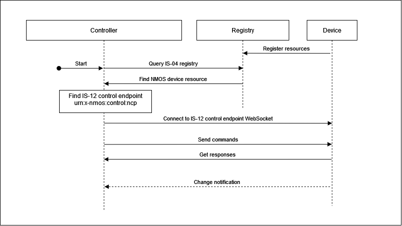
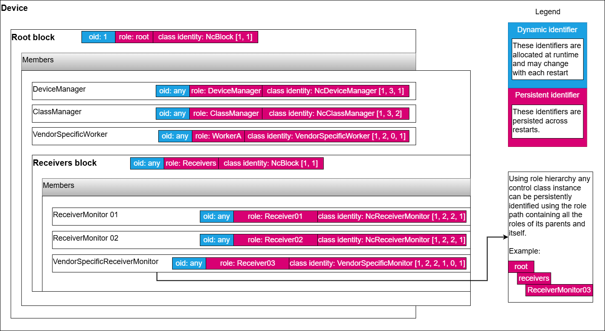

# Controller implementation tutorial

{:.no_toc}

- This will be replaced with a table of contents
{:toc}

This section covers quickly building an MS-05 / IS-12 / BCP-008 controller implementation.

## Quick checklist

This is a summary of the main areas to consider when starting your implementation.

- Add ability to consume control classes
  - Objects - treatment for NcObject base class model which every other class derives from
    - Oid - all objects have an oid identifier
    - Role - all objects have a role identifier (their role within their block owner)
    - ClassId - all objects have a classId
    - Get method - treatment generic Get method
    - Set method - treatment generic Set method
  - Blocks - treatment for NcBlock class model which every block instance uses
    - Members - all blocks have members which can be iterated recursively to discover the whole device structure
    - Find members - all blocks have Find methods to retrieve members by role path or classId
    - Root block - treatment for working with the root block (top most container of all other objects)
      - Fixed role - Root block has a fixed role of `root`
      - Fixed oid - Root block has a fixed oid of `1`
  - Managers
    - NcDeviceManager - treatment for working with the Device manager in order to retrieve basic device information
    - NcClassManager - treatment for working with the Class manager in order to handle model discovery
      - Class discovery - perform definition discovery for all classes used
      - Datatype discovery - perform datatype definition discovery for all datatypes used
- Implement control protocol
  - Endpoint advertisement - Discover the IS-12 control endpoint in the IS-04 device
  - Issue commands and consume responses - Issue commands to objects targeted by oids and react to responses
  - Subscriptions, events and notifications - Issue Subscription command, and consume Notification messages for property changed events of objects subscribed

The following are other important areas relevant when working with devices which employ specific functionality.

- Status monitors - treatment for NcStatusMonitor class model which every other status monitor derives from
  - Overall status - ability to consume overallStatus and overallStatusMessage properties
  - Sender monitors - treatment for NcSenderMonitor class model
    - Domain status reporting - ability to consume relevant statuses, status messages and status transition counters for each relevant domain (Connectivity, Synchronization, Stream validation)
  - Receiver monitors - treatment for NcReceiverMonitor class model
    - Domain status reporting - ability to consume relevant statuses, status messages and status transition counters for each relevant domain (Connectivity, Synchronization, Stream validation)
- Non-standard classes
  - Vendor specific workers - Ability to work generically with vendor specific classes by using the Class manager to discover their class definition and then interact with the properties and methods advertised

Further detail for each step is included in the [Guidance](#guidance) section.

## Guidance

This section provides guidance in select focus areas required for controller implementations.

The basic controller workflow follows the diagram below where individual steps are detailed in the following subsections.

|  |
|:--:|
| _**Basic controller sequence**_ |

### Exploring the device model

As per the [MS-05-02](https://specs.amwa.tv/ms-05-02/latest/docs/Blocks.html) specification all MS-05 / IS-12 devices expose a structure starting with the root block which always has an `oid` of 1.

The root block, among other things holds [Managers](https://specs.amwa.tv/ms-05-02/latest/docs/Managers.html) which are special singleton control classes which collate information which pertains to the entire device.

A minimal implementation of a device has at least two managers listed in the root block:

- Device manager
- Class manager

|  |
|:--:|
| _**Typical device structure**_ |

A controller is expected to [Discover the structure](https://specs.amwa.tv/is-12/latest/docs/Exploring_the_device_model.html) of a device by recursively querying the members of nested blocks. It also discovers the implemented managers in the root block by checking their class identity or roles.

|  |
|:--:|
| _**Exploring the device model**_ |

As per the [MS-05-01](https://specs.amwa.tv/ms-05-01/latest/docs/Identification.html) specification there are different types of identifiers which ultimately can be split into two categories:

- dynamic identifiers (object identifiers)
- persistent identifiers (roles, class identities and data type names)

|  |
|:--:|
| _**Identities**_ |

A controller is expected to be able to work with all the identifiers exposed by a device.

`Note`: Persistent identifiers like role paths can be used to consistently identify a particular control class instance in the device structure and then rediscover some of its properties including the runtime object id.

#### Control class definition discovery

Controllers are expected to use the [Class manager](https://specs.amwa.tv/is-12/latest/docs/Class_definition_discovery.html) in order to discover any control classes used by the devices they are connected to.

#### Data type definition discovery

Controllers are expected to use the [Class manager](https://specs.amwa.tv/is-12/latest/docs/Data_type_definition_discovery.html) in order to discover any data types used by the devices they are connected to.

### Discovering the device control endpoint (in NMOS IS-04)

The [NMOS IS-12](https://specs.amwa.tv/is-12/latest/docs/IS-04_interactions.html) specification explains that the control endpoint is advertised in the controls array as part of the NMOS device resource. The schema for the NMOS device resource is available in the [NMOS IS-04](https://specs.amwa.tv/is-04/latest/APIs/schemas/with-refs/device.html) specification.

This means that a controller can discover if an NMOS device exposes an NMOS IS-12 control endpoint by checking if the controls array in the NMOS device resource contains the control type of `urn:x-nmos:control:ncp`.

Control endpoint example:

```json
{
  ...
    "senders": [
        ...
    ],
    "receivers": [
        ...
    ],
    "controls": [
        {
            "type": "urn:x-nmos:control:ncp/v1.0",
            "href": "ws://hostname/example"
        }
    ],
    "type": "urn:x-nmos:device:generic",
    "id": "58f6b536-ca4c-43fd-880a-9df2501fc125",
  ...
}
```

The controller can then use the discovered control endpoint to make the initial WebSocket connection which will subsequently be used for NMOS IS-12 parameter control.

### Sending commands and receiving responses

As per the [NMOS IS-12](https://specs.amwa.tv/is-12/latest/docs/Protocol_messaging.html#command-message-type) specification a controller can send [Commands](https://specs.amwa.tv/is-12/latest/docs/Sending_commands.html) and receive responses.

`Note`: Multiple commands can be sent in the commands array.

As per the [MS-05-02](https://specs.amwa.tv/ms-05-02/latest/docs/NcObject.html#generic-getter-and-setter) specification all control classes inherit from `NcObject` which specifies generic `Get` and `Set` methods.

These methods can be used by a controller to get the value of a property in an object or set the value of a property in an object if write allowed.

### Subscribing and receiving notifications

As per the [MS-05-02](https://specs.amwa.tv/ms-05-02/latest/docs/NcObject.html#propertychanged-event) specification all control classes inherit from `NcObject` which specifies the `PropertyChanged` event.

This means any object can be subscribed to in order to receive property change notifications.

A controller is expected to [Subscribe](https://specs.amwa.tv/is-12/latest/docs/Subscribing_to_events.html) to object ids it is interested in by sending `Subscription` messages as specified in [NMOS IS-12](https://specs.amwa.tv/is-12/latest/docs/Protocol_messaging.html).

#### Status monitors

[BCP-008-01](https://specs.amwa.tv/bcp-008-01/) and [BCP-008-01](https://specs.amwa.tv/bcp-008-02/) define specialised NcReceiverMonitor and NcSenderMonitor worker classes which report relevant statuses, status messages and status transition counters for relevant domains like Connectivity, Synchronization or Stream validation.

Objects implementing these classes publish the IS-04 resource identity they are monitoring (Sender or Receiver) through the [context identity mapping mechanism](#context-identity-mapping).

Sender and Receiver monitors derive from the base class NcStatusMonitor which specified an `overallStatus` property. This property combines the specific domain statuses of a monitor into a single status which can be more easily observed and displayed by a simple client.

Controllers are expected to be able to find all status monitors published by a device and be able to retrieve statuses, status messages and status transition counters for relevant domains from these objects. They are also expected to retrieve the overallStatus property of each status monitor object.

For full controller requirements check the relevant sections in [BCP-008-01](https://specs.amwa.tv/bcp-008-01/branches/v1.0-dev/docs/Overview.html#controller) and [BCP-008-02](https://specs.amwa.tv/bcp-008-02/branches/v1.0-dev/docs/Overview.html#controller).

### Context identity mapping

[MS-05-02](https://specs.amwa.tv/ms-05-02/latest/docs/NcObject.html#touchpoints) specifies an identity mapping mechanism available in the base `NcObject` class. This touchpoint mechanism can be used to associate identities from outside contexts with entities inside the control structure of the device.

Examples include [Receiver monitors](https://specs.amwa.tv/bcp-008-01/branches/v1.0-dev/docs/Overview.html#touchpoints-and-is-04-receivers) and [Sender monitors](https://specs.amwa.tv/bcp-008-02/branches/v1.0-dev/docs/Overview.html#touchpoints-and-is-04-senders) which is express domain health statuses for an attached stream receiver or sender.

This allows for a `Receiver monitor` to be associated with a specific [NMOS IS-04](https://specs.amwa.tv/is-04/) receiver.

A controller is expected to decode touchpoint information where available and associate identities if it has access to the data domains exposed (For example a controller would be able to identify which NMOS IS-04 receiver is associated with a given `Receiver monitor` object).

|  |
|:--:|
| _**Context identity mapping**_ |

### Discovering non-standard models used to model vendor specific functionality

As per the [MS-05-02](https://specs.amwa.tv/ms-05-02/latest/docs/Managers.html#class-manager) specification the `Class manager` can be used to discover the properties of any control class and the fields of any data type.

Non-standard control classes can be created by branching off from a standard control class and following the class ID generation guidelines specified in [MS-05-01](https://specs.amwa.tv/ms-05-01/latest/docs/Appendix_A_-_Class_ID_Format.html).

Here is an example of a new worker control class called `DemoClassAlpha`. It inherits from [NcWorker](https://specs.amwa.tv/ms-05-02/latest/docs/Framework.html#ncworker) which has a classId of `[1, 2]` and adds the authority key (in this case 0, but would be a negative number if the vendor has an OUI or CID) followed by the index 1.

```json
{
  "role": "DemoClassAlpha",
  "oid": 111,
  "constantOid": true,
  "classId": [
      1,
      2,
      0,
      1
    ],
  "userLabel": "Demo class alpha",
  "owner": 1,
  "description": "Demo control class alpha",
  "constraints": null
}
```

A subsequent non-standard worker would look like this:

```json
{
  "role": "DemoClassBeta",
  "oid": 150,
  "constantOid": true,
  "classId": [
      1,
      2,
      0,
      2
    ],
  "userLabel": "Demo class beta",
  "owner": 1,
  "description": "Demo control class beta",
  "constraints": null
}
```

ensuring class identity uniqueness.

Controllers are expected to use the class identity lineage information alongside their core framework knowledge to determine when a control class is a non-standard control class.
The following diagram shows how a vendor created a vendor specific Receiver monitor by deriving the standard Receiver monitor class.

|  |
|:--:|
| _**Non-standard branching**_ |

## How to

HOW TO practical examples are available [here](How%20To%20practical%20examples.md).
