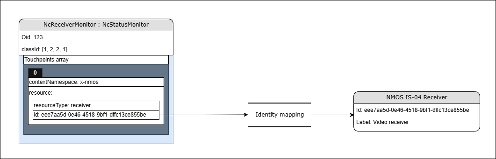

# Device implementation tutorial

{:.no_toc}

- This will be replaced with a table of contents
{:toc}

This section covers the basis for quickly building an MS-05 / IS-12 device implementation.

## Guidance

This section provides guidance in select focus areas required for device implementations.

For full definitions of models referred to in this document please check the [IDL](https://github.com/AMWA-TV/ms-05-02/blob/v1.0-dev/idl/NC-Framework.webidl).

The basic device workflow follows the diagram below where individual steps are detailed in the following subsections.

|  |
|:--:|
| _**Basic device sequence**_ |

### Modelling the control classes

As per the [MS-05-02](https://specs.amwa.tv/ms-05-02/branches/v1.0-dev/docs/NcObject.html) specification all control classes must inherit from `NcObject`.

This base control class exposes important properties but also [generic methods](https://specs.amwa.tv/ms-05-02/branches/v1.0-dev/docs/NcObject.html#generic-getter-and-setter) for getting and setting property values.

`NcObject` also defines the [PropertyChanged](https://specs.amwa.tv/ms-05-02/branches/v1.0-dev/docs/NcObject.html#propertychanged-event) event which is fundamental for subscriptions and notifications to work.

As per the [MS-05-01](https://specs.amwa.tv/ms-05-01/branches/v1.0-dev/docs/Identification.html) specification there are different types of identifiers which ultimately can be split into two categories:

- dynamic identifiers (object identifiers)
- persistent identifiers (roles, class identities and data type names)

|  |
|:--:|
| _**Identities**_ |

#### Block control classes

As per the [MS-05-02](https://specs.amwa.tv/ms-05-02/branches/v1.0-dev/docs/Blocks.html) specification blocks are containers for other control classes.

All devices have at the very least a `root block` which is the top most block in the device tree. The root block has an `oid` of 1 and the role of `root`.

Control classes which are nested inside a block are advertised using descriptors in the members property (`2p10`) of [NcBlock](https://github.com/AMWA-TV/ms-05-02/blob/v1.0-dev/idl/NC-Framework.webidl).

The members property in blocks enables [tree discovery](https://specs.amwa.tv/ms-05-02/branches/v1.0-dev/docs/Blocks.html#tree-discovery) of the device structure.

Blocks are also useful for quickly finding a particular control class by using the [search methods](https://specs.amwa.tv/ms-05-02/branches/v1.0-dev/docs/Blocks.html#tree-discovery) provided.

#### Manager control classes

As per the [MS-05-02](https://specs.amwa.tv/ms-05-02/branches/v1.0-dev/docs/Managers.html) specification managers are special classes which collate information which pertains to the entire device.

Typical managers included in the root block are:

- Device manager (holds general information about the device including product information and serial numbers)
- Subscription manager (offers means of subscribing to events thus enabling notifications)
- Class manager (offers means of class and data type discovery)

#### Worker control classes

As per the [MS-05-02](https://specs.amwa.tv/ms-05-02/branches/v1.0-dev/docs/Workers.html) specification workers are special classes which handle control or monitoring features for a particular specific device domain.

Different devices will need to use different workers depending on their functionality set.

Indeed, sometimes devices might also need to create vendor specific worker classes (see [Vendor specific control classes](Device%20implementation%20tutorial.md#vendor-specific-control-classes)) either because they implement functionality not catered yet by the standard framework or because they require to derive a standard control class worker.

#### Context identity mapping (Receiver monitor example)

[MS-05-02](https://specs.amwa.tv/ms-05-02/branches/v1.0-dev/docs/NcObject.html#touchpoints) specifies an identity mapping mechanism available in the base `NcObject` class. This touchpoint mechanism can be used to expose and associate identities from outside contexts with entities inside the control structure of the device.

One such example is the [ReceiverMonitor](https://specs.amwa.tv/ms-05-02/branches/v1.0-dev/docs/Feature_sets.html#ncreceivermonitor) control class which is used to express connection and payload statuses for an attached stream receiver.

This allows for a `Receiver monitor` to be associated with a specific [NMOS IS-04](https://specs.amwa.tv/is-04/) receiver.

A device is expected to offer touchpoints to map identities wherever relevant (For example if the device has a specific worker class like the `Receiver monitor` which is linked to a resource in another context or specification like an NMOS IS-05 receiver).

|  |
|:--:|
| _**Context identity mapping**_ |

#### Minimum requirements

As per the [MS-05-02](https://specs.amwa.tv/ms-05-02/branches/v1.0-dev/docs/Blocks.html) specification all MS-05 / IS-12 devices need to expose a structure starting with the root block which always has an `oid` of 1.

A minimal implementation of a device will have at least three [managers](Device%20implementation%20tutorial.md#manager-control-classes) listed in the root block:

- Device manager
- Subscription manager
- Class manager

|  |
|:--:|
| _**Typical device structure**_ |

A device is expected to allow its structure to be discovered (see [Block control classes](Device%20implementation%20tutorial.md#block-control-classes)) by exposing all of its features in nested blocks starting with the `root block`.

#### Vendor specific control classes

Vendor specific control classes can be created by branching off from a standard control class and following the class ID generation guidelines specified in [MS-05-01](https://specs.amwa.tv/ms-05-01/branches/v1.0-dev/docs/Appendix_A_-_Class_ID_Format.html).

Here is an example of a new worker control class called `DemoClassAlpha`. It inherits from [NcWorker](https://github.com/AMWA-TV/ms-05-02/blob/v1.0-dev/idl/NC-Framework.webidl) which has an identity of `[1, 2]` and adds the authority key (in this case 0, but should be a negative number if the vendor has an OUI or CID) followed by the index 1.

```json
{
  "role": "DemoClassAlpha",
  "oid": 111,
  "constantOid": true,
  "identity": {
    "id": [
      1,
      2,
      0,
      1
    ],
    "version": "1.0.0"
  },
  "userLabel": "Demo class alpha",
  "owner": 1,
  "description": "Demo control class alpha",
  "constraints": null
}
```

A subsequent vendor specific worker would look like this:

```json
{
  "role": "DemoClassBeta",
  "oid": 150,
  "constantOid": true,
  "identity": {
    "id": [
      1,
      2,
      0,
      2
    ],
    "version": "1.0.0"
  },
  "userLabel": "Demo class beta",
  "owner": 1,
  "description": "Demo control class beta",
  "constraints": null
}
```

ensuring class identity uniqueness.

|  |
|:--:|
| _**Vendor specific branching**_ |

### Exposing models through the protocol

After a device has initiated its device tree structure and allocated oids to every control class instance, it then either waits for external commands which interact with these entities (e.g. get/set values, invoke actions) or sends notifications for properties which have changed if there are subscribers.

[IS-12](https://specs.amwa.tv/is-12/branches/v1.0-dev/docs/Protocol_messaging.html) defines the protocol messaging behavior but also what the different JSON representations are for specific [data types](https://specs.amwa.tv/is-12/branches/v1.0-dev/docs/Data_type_marshalling.html).

#### Control endpoint advertisement (in NMOS IS-04)

The [NMOS IS-12](https://specs.amwa.tv/is-12/branches/v1.0-dev/docs/IS-04_interactions.html) specification explains that the control endpoint is advertised in the controls array as part of the NMOS device resource. The schema for the NMOS device resource is available in the [NMOS IS-04](https://specs.amwa.tv/is-04/branches/v1.3.x/APIs/schemas/with-refs/device.html) specification.

It is expected that an IS-12 enabled device exposes a `urn:x-nmos:control:ncp` control type in the controls array for its NMOS device resource.

Control endpoint example:

```json
{
  ...
    "senders": [
        ...
    ],
    "receivers": [
        ...
    ],
    "controls": [
        {
            "type": "urn:x-nmos:control:ncp/v1.0",
            "href": "ws://hostname/example"
        }
    ],
    "type": "urn:x-nmos:device:generic",
    "id": "58f6b536-ca4c-43fd-880a-9df2501fc125",
  ...
}
```

#### Keeping track of control sessions

As per the [NMOS IS-12](https://specs.amwa.tv/is-12/branches/v1.0-dev/docs/Protocol_messaging.html#session-creation) specification a device needs to be able to respond to a [CreateSession](https://specs.amwa.tv/is-12/branches/v1.0-dev/docs/Creating_a_session.html) message being received.

The control session provides the control context for subsequent commands, receiving responses and notifications. It also specifies how often heartbeats are sent (see [Handling heartbeats](Device%20implementation%20tutorial.md#handling-heartbeats)).

A device is expected to allocate a `session id` and offer its value in the response message sent after a valid `Create session` message is received. This `session id` will be used in every subsequent communication and the device needs to use it whenever it determines if notifications need to be sent to a specific controller.

Controllers will send the desired `heartbeat interval` when sending a `Create session` message. Devices then need to use this interval to validate if [heartbeat](Device%20implementation%20tutorial.md#handling-heartbeats) messages are sent at correct intervals.

#### Mapping commands and returning responses

As per the [NMOS IS-12](https://specs.amwa.tv/is-12/branches/v1.0-dev/docs/Protocol_messaging.html#command-message-type) specification a device is expected to respond to [Commands](https://specs.amwa.tv/is-12/branches/v1.0-dev/docs/Sending_commands.html) sent by a controller.

`Note`: Multiple commands can be sent in the messages array.

As per the [MS-05-02](https://specs.amwa.tv/ms-05-02/branches/v1.0-dev/docs/NcObject.html#generic-getter-and-setter) specification all control classes must inherit from `NcObject` which specifies generic `Get` and `Set` methods.

These methods can be used by a controller to get the value of a property in a control class or set the value of a property in a control class if write allowed. Furthermore, any control class may have its own methods which can be invoked in the same way as the generic methods.

As specified by the [IDL](https://github.com/AMWA-TV/ms-05-02/blob/v1.0-dev/idl/NC-Framework.webidl) any method response must inherit from the base data type `NcMethodResult`.

|  |
|:--:|
| _**Command example**_ |

#### Subscriptions, events and notifications

As per the [MS-05-02](https://specs.amwa.tv/ms-05-02/branches/v1.0-dev/docs/NcObject.html#propertychanged-event) specification all control classes must inherit from `NcObject` which specifies the `PropertyChanged` event.

This means any properties in any control class can be subscribed to in order to receive change notifications. Subscriptions are handled by the [Subscription manager](https://specs.amwa.tv/ms-05-02/branches/v1.0-dev/docs/Managers.html#subscription-manager).

A device is expected to allow controllers to [Subscribe](https://specs.amwa.tv/is-12/branches/v1.0-dev/docs/Subscribing_to_events.html) to object ids it is interested in by correctly handling commands sent to the `Subscription manager`.

A device is also expected to use the [session id](Device%20implementation%20tutorial.md#keeping-track-of-control-sessions) context and the subscriptions received in order to determine when a notification message needs to be sent to a controller.

#### Handling heartbeats

As per the [NMOS IS-12](https://specs.amwa.tv/is-12/branches/v1.0-dev/docs/Protocol_messaging.html#heartbeats) specification a controller is required to send [Heartbeat](https://specs.amwa.tv/is-12/branches/v1.0-dev/docs/Sending_heartbeats.html) messages for their control sessions at the intervals specified when creating the session (see [Keeping track of control sessions](Device%20implementation%20tutorial.md#keeping-track-of-control-sessions)).

Devices are expected to acknowledge each heartbeat with a response.

## How to

HOW TO practical examples are available [here](How%20To%20practical%20examples.md).
