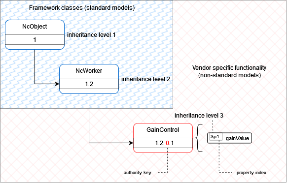

# How To practical examples

{:.no_toc}

- This will be replaced with a table of contents
{:toc}

## Introduction

This section showcases practical examples on the journey to implementing MS-05 / IS-12 in a device and as such provides a practical example of how to implement an NMOS Control Framework Device on a Linux system using the NMOS Control Mock Device.

`Note`: The NMOS Control Mock Device application is a cross platform application and can run on Linux, MacOS and Windows.

The HOWTO is meant to provide a relatively simple, easy-to-follow "recipe" for getting a controllable NMOS Node up and running in a short period of time.
It is not intended to be a tutorial article, and therefore, it excludes explanation regarding the NMOS Control Framework. The reader is referred to the tutorial section for more depth coverage of the framework.

The reader is assumed to have some experience with an NMOS infrastructure including IS-04 and NMOS Registration and Discovery (RDS). Also some experience in JavaScript and/or typescript will be helpful although not entirely required.

This HOW-TO also demonstrates to a certain extent how to construct and operate an NMOS Controller that interacts with the NMOS Control Device. In the HOW-TO, you will be the controller - creating, issuing and reading information from JSON commands and responses sent and received via a standard WebSocket connecting you with the controlled device.

## HOWTO Steps

This HOWTO will present the steps to install, modify and try out the NMOS Control Framework. The HOW-TO uses a fresh Ubuntu 20.04 installation.

### Basic Installation

This section will cover the basic steps to get a mock NMOS Controllable Node running on your system:

- Install the NMOS Controllable Mock Device (NCMD)
- Install the EasyNMOS Docker container which provides an NMOS RDS
- Verify NCMD registers and exposes it's NMOS IS-12 Control endpoint in the NMOS RDS
- Install a Chrome WebSocket extension
- Verify the NCMD can be reached via the WebSocket Control endpoint listed in the RDS
- Explore the device model by getting the members of blocks
- Verify the ability to read, and write a property of the NCMD
- Add a subscription in order to receive notifications for any changes experienced by properties of the NCMD
- Modify the value of a property and verify notification are received

### Non-standard control classes

This section will explain how the NCMD has created a non-standard control class to expose vendor specific functionality in the form of a `GainControl` class.

## Installing the Mock NMOS Control Device

Install the NMOS Mock control device from its location on the public GitHub [repo](https://github.com/AMWA-TV/nmos-device-control-mock).

Follow the steps below from any directory on your Ubuntu host:

### Install the required packages

You will need `docker` for running the NMOS RDS and `npm` for running the mock NMOS Controllable Node. We first assume a fresh install of Ubuntu 20.04 and so do an update for packages prior to installation of required dependencies.

```txt
sudo apt-get update
sudo apt install -y npm
sudo apt install -y docker.io
```

Now install an NMOS RDS. We will use the RDS from [EasyNMOS](https://github.com/rhastie/easy-nmos)

You will run the RDS from one terminal window and the mock node from another. Open a terminal window and perform the following commands:

```txt
sudo docker pull rhastie/nmos-cpp:latest
```

**Expected Output**

```txt
latest: Pulling from rhastie/nmos-cpp
3b65ec22a9e9: Pull complete 
964e9f4b2501: Pull complete 
5312be12420b: Pull complete 
037321a10163: Pull complete 
4f4fb700ef54: Pull complete 
Digest: sha256:bd2cdeb5263d555cfe0e427099251d287f3f343af09789e82354deb3049d4a2d
Status: Downloaded newer image for rhastie/nmos-cpp:latest
docker.io/rhastie/nmos-cpp:latest
```

**Run and Verify the RDS**

```txt
sudo docker run -d -p 80:8010 -p 8011:8011 --name RDS rhastie/nmos-cpp:latest
sudo docker ps
```

**Expected Output**

The output of `sudo docker ps` will show the EasyNMOS NMOS docker image is up and running and required ports are mapped from the host's network to the docker container network.

```txt
CONTAINER ID   IMAGE                     COMMAND                 CREATED         STATUS         PORTS                                                                                                                   NAMES
9a8890946623   rhastie/nmos-cpp:latest   "/home/entrypoint.sh"   9 seconds ago   Up 8 seconds   1883/tcp, 11000-11001/tcp, 5353/udp, 0.0.0.0:8011->8011/tcp, :::8011->8011/tcp, 0.0.0.0:80->8010/tcp, :::80->8010/tcp   RDS
```

Verify the web server in the EasyNMOS docker container is up and running by opening [http://localhost/admin](http://localhost/admin) on your host. You should see the welcome screen for the open-source NVIDIA NMOS Commissioning Controller.

Now install the mock device from the repo:

```txt
git clone https://github.com/AMWA-TV/nmos-device-control-mock.git
cd nmos-device-control-mock/code
npm install
npm run build-and-start
```

**Expected output**

The output of npm run build-and-start will show status as the mock node is built and ran. The last few lines of the output will show the mock device registering with the RDS running as part of the docker image started above.

```log
App started
Configuration: Reading config.json
Configuration - CheckIdentifiers()
Configuration - CheckDistinguishingInformation()
RegistrationClient - RegisterOrUpdateResource(resourceType:node)
Server started on port 8080
RegistrationClient - RegisterOrUpdateResource(resourceType:device)
RegistrationClient - RegisterOrUpdateResource(resourceType:receiver)
```

**Locate the NMOS IS-12 Control WebSocket**

You now have all the NMOS items needed to interact with the NMOS Control mock node. Since IS-12 uses a WebSocket control endpoint we will next browse the RDS registry to find the advertised WebSocket endpoint and use a Chrome extension that allows opening that WebSocket and sending and receiving IS-12 JSON formatted commands and responses.

Navigate in your preferred browser to the devices query location:
`http://127.0.0.1/x-nmos/query/v1.3/devices/`

**Expected output**

```json
[
  {
    "controls": [
      {
        "href": "http://127.0.0.1:8080/x-nmos/connection/v1.1/",
        "type": "urn:x-nmos:control:sr-ctrl/v1.1"
      },
      {
        "href": "http://127.0.0.1:8080/x-nmos/connection/v1.0/",
        "type": "urn:x-nmos:control:sr-ctrl/v1.0"
      },
      {
        "href": "ws://127.0.0.1:8080/x-nmos/ncp/v1.0/connect",
        "type": "urn:x-nmos:control:ncp/v1.0"
      }
    ],
    "description": "NC-01 device",
    "id": "7977373c-70f6-4e62-b713-3431f1ac4a2f",
    "label": "NC-01 device",
    "node_id": "e0f9e1a3-2a2f-4f00-b02e-76d8286e1d98",
    "receivers": [
      "18eae0e9-dcf4-40ff-88a3-cb553993d1b8"
    ],
    "senders": [],
    "tags": {
      "urn:x-nmos:tag:asset:function/v1.0": [
        "UHD Decoder"
      ],
      "urn:x-nmos:tag:asset:instance-id/v1.0": [
        "XYZ123-456789-D"
      ],
      "urn:x-nmos:tag:asset:manufacturer/v1.0": [
        "ACME-D"
      ],
      "urn:x-nmos:tag:asset:product/v1.0": [
        "Widget Pro-D"
      ]
    },
    "type": "urn:x-nmos:device:generic",
    "version": "1686060930:0"
  }
]
```

In the controls section of the JSON response you will find a control with the type of `urn:x-nmos:control:ncp/v1.0`. The href of this control is the uri we need to connect to:

`ws://127.0.0.1:8080/x-nmos/ncp/v1.0/connect`

This is the IS-12 WebSocket control endpoint used to interact with the device.

**Install Chrome WebSocket Plugin**

We will install a Chrome WebSocket extension. Other WebSocket clients will work equally well.

Details on installing Chrome extensions can be found [here](https://support.google.com/chrome_webstore/answer/2664769?hl=en). Follow the instructions to open the Chrome Web Store and search for WebSocket King Client. Install this extension.

After completing the installation of WebSocket King open the extension in a new browser window. Copy and paste the WebSocket located in the RDS for the NC-01 NMOS Control Mock node into the connections field and click `connect`. The `Connect` button should turn to `Disconnect` indicating a successful connection to the NC-01 WebSocket endpoint.

Next we will verify the ability to read and write to the device model on the mock node.  
For purposes of this HOW-TO we will focus on working with the root block and its properties. Note that in an actual system most of the manual steps we are performing here would be performed by an NMOS Controller using the IS-12 specification. For more information about implementing an IS-12 NMOS Controller see the HOW-TO section for [Controller implementations](Controller%20implementation%20tutorial.md).

Next retrieve the members of the root block by sending the following JSON formatted command to the NC-01 WebSocket. In the JSON command the value of `oid` 1 indicates we are directing this command at the [root block](https://specs.amwa.tv/ms-05-02/branches/v1.0-dev/docs/Blocks.html). The `methodId` with level 1 and index 1 is the [getter](https://specs.amwa.tv/ms-05-02/branches/v1.0-dev/docs/NcObject.html#generic-getter-and-setter) method and the `id` level and index of 2 and 2 respectively targets the `2p2` `members` property of the root [block](https://specs.amwa.tv/ms-05-02/branches/v1.0-dev/docs/Framework.html#ncblock).

```json
{
  "protocolVersion": "1.0.0",
  "messageType": 0,
  "commands": [
    {
      "handle": 1,
      "oid": 1,
      "methodId": {
        "level": 1,
        "index": 1
      },
      "arguments": {
        "id": {
          "level": 2,
          "index": 2
        }
      }
    }
  ]
}
```

**Expected Output**

The device responds with a JSON containing [NcBlockMemberDescriptor](https://specs.amwa.tv/ms-05-02/branches/v1.0-dev/docs/Framework.html#ncblockmemberdescriptor) member descriptors for the root block. Every member class can be determined by reading the `classId` field and they can be targeted with commands by using their `oid` value.

```json
{
  "protocolVersion": "1.0.0",
  "messageType": 1,
  "responses": [
    {
      "handle": 1,
      "result": {
        "status": 200,
        "value": [
          {
            "role": "DeviceManager",
            "oid": 2,
            "constantOid": true,
            "classId": [
              1,
              3,
              1
            ],
            "userLabel": "Device manager",
            "owner": 1,
            "description": "The device manager offers information about the product this device is representing"
          },
          {
            "role": "ClassManager",
            "oid": 3,
            "constantOid": true,
            "classId": [
              1,
              3,
              2
            ],
            "userLabel": "Class manager",
            "owner": 1,
            "description": "The class manager offers access to control class and data type descriptors"
          },
          {
            "role": "receivers",
            "oid": 10,
            "constantOid": true,
            "classId": [
              1,
              1
            ],
            "userLabel": "Receivers",
            "owner": 1,
            "description": "Receivers block"
          },
          {
            "role": "stereo-gain",
            "oid": 31,
            "constantOid": true,
            "classId": [
              1,
              1
            ],
            "userLabel": "Stereo gain",
            "owner": 1,
            "description": "Stereo gain block"
          },
          {
            "role": "ExampleControl",
            "oid": 111,
            "constantOid": true,
            "classId": [
              1,
              2,
              0,
              2
            ],
            "userLabel": "Example control worker",
            "owner": 1,
            "description": "Example control worker"
          },
          {
            "role": "IdentBeacon",
            "oid": 51,
            "constantOid": true,
            "classId": [
              1,
              2,
              2
            ],
            "userLabel": "Identification beacon",
            "owner": 1,
            "description": "Identification beacon"
          }
        ]
      }
    }
  ]
}
```

In the response above we can see that the "Stereo gain" member is a block because of its classId of `[1, 1]`. That means we can next retrieve the members of the "Stereo gain" block by sending the following JSON formatted command to the NC-01 WebSocket. In the JSON command the value of `oid` 31 indicates we are directing this command at the "Stereo gain" object.

```json
{
  "protocolVersion": "1.0.0",
  "messageType": 0,
  "commands": [
    {
      "handle": 2,
      "oid": 31,
      "methodId": {
        "level": 1,
        "index": 1
      },
      "arguments": {
        "id": {
          "level": 2,
          "index": 2
        }
      }
    }
  ]
}
```

**Expected Output**

The device responds with a JSON containing the member descriptors for the "Stereo gain" block.

```json
{
  "protocolVersion": "1.0.0",
  "messageType": 1,
  "responses": [
    {
      "handle": 2,
      "result": {
        "status": 200,
        "value": [
          {
            "role": "channel-gain",
            "oid": 21,
            "constantOid": true,
            "classId": [
              1,
              1
            ],
            "userLabel": "Channel gain",
            "owner": 31,
            "description": "Channel gain block"
          },
          {
            "role": "master-gain",
            "oid": 24,
            "constantOid": true,
            "classId": [
              1,
              2,
              0,
              1
            ],
            "userLabel": "Master gain",
            "owner": 31,
            "description": "Master gain"
          }
        ]
      }
    }
  ]
}
```

Repeating the process of retrieving the members for all nested blocks allows a controller to discover the entire device model.

**Read, Write the root block user label**

You will now make use of the generic [Get method](https://specs.amwa.tv/ms-05-02/branches/v1.0-dev/docs/NcObject.html#generic-getter-and-setter) (level 1, index 1) to read the value of the `userLabel` (level 1, index 6) property of the root block. All classes contain the `userLabel` property as defined in [NcObject](https://specs.amwa.tv/ms-05-02/branches/v1.0-dev/docs/Framework.html#ncobject).

```json
{
  "protocolVersion": "1.0.0",
  "messageType": 0,
  "commands": [
    {
      "handle": 3,
      "oid": 1,
      "methodId": {
        "level": 1,
        "index": 1
      },
      "arguments": {
        "id": {
          "level": 1,
          "index": 6
        }
      }
    }
  ]
}
```

**Expected Output**

The device responds to the above command with a JSON formatted response containing a result of type [NcMethodResultPropertyValue](https://specs.amwa.tv/ms-05-02/branches/v1.0-dev/docs/Framework.html#ncmethodresultpropertyvalue) holding the value of "Root".

```json
{
  "protocolVersion": "1.0.0",
  "messageType": 3,
  "responses": [
    {
      "handle": 3,
      "result": {
        "status": 200,
        "value": "Root"
      }
    }
  ]
}
```

Now we will set the `userLabel` (1p6) to "My mock device HOWTO" and verify the change has taken effect. We will use the generic [Set method](https://specs.amwa.tv/ms-05-02/branches/v1.0-dev/docs/NcObject.html#generic-getter-and-setter) for this (level 1, index 2). Copy and paste the following JSON formatted command to set the new value:

```json
{
  "protocolVersion": "1.0.0",
  "messageType": 0,
  "commands": [
    {
      "handle": 4,
      "oid": 1,
      "methodId": {
        "level": 1,
        "index": 2
      },
      "arguments": {
        "id": {
          "level": 1,
          "index": 6
        },
        "value": "My mock device HOWTO"
      }
    }
  ]
}
```

**Expected result**

The command should be accepted with no errors. The JSON response to the command should indicate a status of 200 (Ok).

Now retrieve the `userLabel` property again.

```json
{
  "protocolVersion": "1.0.0",
  "messageType": 0,
  "commands": [
    {
      "handle": 5,
      "oid": 1,
      "methodId": {
        "level": 1,
        "index": 1
      },
      "arguments": {
        "id": {
          "level": 1,
          "index": 6
        }
      }
    }
  ]
}
```

**Expected result**

The device returns the new value of "My mock device HOWTO" in the response.

```json
{
  "protocolVersion": "1.0.0",
  "messageType": 1,
  "responses": [
    {
      "handle": 5,
      "result": {
        "status": 200,
        "value": "My mock device HOWTO"
      }
    }
  ]
}
```

**Subscribe to property changes for the `userLabel`**

Add a subscription to changes on the root block by sending a `Subscription` message. Paste in the JSON formatted command below to subscribe for changes. Note that the message targets the root block by including its `oid` of 1 in the subscriptions array.

```json
{
  "protocolVersion": "1.0.0",
  "messageType": 3,
  "subscriptions": [
    1
  ]
}
```

**Expected result**

The device will respond with a `SubscriptionResponse` message indicating the subscription request was accepted.

```json
{
  "protocolVersion": "1.0.0",
  "messageType": 4,
  "subscriptions": [
    1
  ]
}
```

**Modify the `userLabel` value and check a notification is received**

Now whenever we modify the value of the `userLabel` property we can see notifications arriving.

Try it now by changing the `userLabel` property again to "My mock device HOWTO changed"

```json
{
  "protocolVersion": "1.0.0",
  "messageType": 0,
  "commands": [
    {
      "handle": 6,
      "oid": 1,
      "methodId": {
        "level": 1,
        "index": 2
      },
      "arguments": {
        "id": {
          "level": 1,
          "index": 6
        },
        "value": "My mock device HOWTO changed"
      }
    }
  ]
}
```

**Expected notification**

Since you subscribed for changes on the root block you should see notifications of that change. In the JSON notification you see the `oid` of the root block along with the `propertyId` that was changed (userLabel or 1p6). Finally, the `changeType` and new property `value` are provided in the `eventData`.

```json
{
  "protocolVersion": "1.0.0",
  "messageType": 2,
  "notifications": [
    {
      "oid": 1,
      "eventId": {
        "level": 1,
        "index": 1
      },
      "eventData": {
        "propertyId": {
          "level": 1,
          "index": 6
        },
        "changeType": 0,
        "value": "My mock device HOWTO changed",
        "sequenceItemIndex": null
      }
    }
  ]
}
```

### Section conclusions

In this section of the HOW-TO guide you have setup all required NMOS infrastructure to run and interacted with an NMOS Device that provides NMOS IS-12 functionality. You have provisioned an NMOS RDS so that the NMOS device can register its control endpoint for IS-12 in the form of a standard WebSocket. You have installed the NC-01 mock device and used it to explore the device model by finding nested block members. You have also retrieved and set the `userLabel` property of the root block. You have used manual copy-and-paste of JSON protocol messages to act as an human-in-the-loop NMOS Controller.

In addition you have subscribed to property changes for root block and verified your WebSocket session has received notifications when you changed the `userLabel` property.

## Non-standard control classes

In the previous section we have learned how to explore the device model by getting the members of each nested block.
One of the blocks was the "Stereo gain" block which returned the following member descriptors:

```json
{
  "protocolVersion": "1.0.0",
  "messageType": 1,
  "responses": [
    {
      "handle": 2,
      "result": {
        "status": 200,
        "value": [
          {
            "role": "channel-gain",
            "oid": 21,
            "constantOid": true,
            "classId": [
              1,
              1
            ],
            "userLabel": "Channel gain",
            "owner": 31,
            "description": "Channel gain block"
          },
          {
            "role": "master-gain",
            "oid": 24,
            "constantOid": true,
            "classId": [
              1,
              2,
              0,
              1
            ],
            "userLabel": "Master gain",
            "owner": 31,
            "description": "Master gain"
          }
        ]
      }
    }
  ]
}
```

We can see that one of the members is the "Master gain" which is a non-standard control class because its `classId` property contains an authority key of 0 (see [NcClassId](https://specs.amwa.tv/ms-05-02/branches/v1.0-dev/docs/Framework.html#ncclassid) in the framework for more details). The `classId` property also informs us that the class is derived from the standard class [NcWorker](https://specs.amwa.tv/ms-05-02/branches/v1.0-dev/docs/Framework.html#ncworker).

One of the members of our root block discovered in the previous section was the [Class Manager](https://specs.amwa.tv/ms-05-02/branches/v1.0-dev/docs/Managers.html#class-manager):

```json
{
  "protocolVersion": "1.0.0",
  "messageType": 1,
  "responses": [
    {
      "handle": 1,
      "result": {
        "status": 200,
        "value": [
          {
            "role": "DeviceManager",
            "oid": 2,
            "constantOid": true,
            "classId": [
              1,
              3,
              1
            ],
            "userLabel": "Device manager",
            "owner": 1,
            "description": "The device manager offers information about the product this device is representing"
          },
          {
            "role": "ClassManager",
            "oid": 3,
            "constantOid": true,
            "classId": [
              1,
              3,
              2
            ],
            "userLabel": "Class manager",
            "owner": 1,
            "description": "The class manager offers access to control class and data type descriptors"
          },
          ...
        ]
      }
    }
  ]
}
```

The [Class Manager](https://specs.amwa.tv/ms-05-02/branches/v1.0-dev/docs/Managers.html#class-manager) allows us to retrieve a class descriptor for our "Master gain" control by sending the following command for `oid` 3 representing the Class Manager, invoking method `GetControlClass` (3m1) with arguments including the `classId` of our "Master gain" as the `identity`.

```json
{
  "protocolVersion": "1.0.0",
  "messageType": 0,
  "commands": [
    {
      "handle": 7,
      "oid": 3,
      "methodId": {
        "level": 3,
        "index": 1
      },
      "arguments":
      {
        "identity": [1, 2, 0, 1],
        "includeInherited": false
      }
    }
  ]
}
```

**Expected result**

The device returns the class descriptor in the response. This contains a name, description and descriptors for all of its properties and methods.

```json
{
  "protocolVersion": "1.0.0",
  "messageType": 1,
  "responses": [
    {
      "handle": 7,
      "result": {
        "status": 200,
        "value": {
          "description": "GainControl class descriptor",
          "identity": [
            1,
            2,
            0,
            1
          ],
          "name": "GainControl",
          "fixedRole": null,
          "properties": [
            {
              "description": "Gain value",
              "id": {
                "level": 3,
                "index": 1
              },
              "name": "gainValue",
              "typeName": "NcFloat32",
              "isReadOnly": false,
              "isPersistent": false,
              "isNullable": false,
              "isSequence": false,
              "constraints": null,
              "isDeprecated": false,
              "isConstant": false
            }
          ],
          "methods": [],
          "events": []
        }
      }
    }
  ]
}
```

This reveals that our "Master gain" object is an instance of the `GainControl` non-standard class which holds a numeric property named `gainValue` (level 3 index 1).

As exemplified in the previous section we can now use the `Get` and `Set` methods to retrieve and set the `gainValue` property.

Getting the value by targeting the "Master gain" `oid` of 24 and its `gainValue` property with level 3 and index 1:

```json
{
  "protocolVersion": "1.0.0",
  "messageType": 0,
  "commands": [
    {
      "handle": 8,
      "oid": 24,
      "methodId": {
        "level": 1,
        "index": 1
      },
      "arguments": {
        "id": {
          "level": 3,
          "index": 1
        }
      }
    }
  ]
}
```

Gives us the following response where the `gainValue` is 0.

```json
{
  "protocolVersion": "1.0.0",
  "messageType": 1,
  "responses": [
    {
      "handle": 8,
      "result": {
        "status": 200,
        "value": 0
      }
    }
  ]
}
```

And setting the value to 21

```json
{
  "protocolVersion": "1.0.0",
  "messageType": 0,
  "commands": [
    {
      "handle": 9,
      "oid": 24,
      "methodId": {
        "level": 1,
        "index": 2
      },
      "arguments": {
        "id": {
          "level": 3,
          "index": 1
        },
        "value": 21
      }
    }
  ]
}
```

Gives us the following response

```json
{
  "protocolVersion": "1.0.0",
  "messageType": 1,
  "responses": [
    {
      "handle": 9,
      "result": {
        "status": 200
      }
    }
  ]
}
```

And Getting the value again returns

```json
{
  "protocolVersion": "1.0.0",
  "messageType": 1,
  "responses": [
    {
      "handle": 10,
      "result": {
        "status": 200,
        "value": 21
      }
    }
  ]
}
```

Similar to the previous section we can now subscribe to the "Master gain" for property changes by adding its `oid` to our subscriptions list.

```json
{
  "protocolVersion": "1.0.0",
  "messageType": 3,
  "subscriptions": [
    1,
    24
  ]
}
```

A visual diagram which summarizes the steps taken in the mock device to implement the `GainControl` is available below.

|  |
|:--:|
| _**GainControl model**_ |

The full implementation of the `GainControl` can be viewed in the code base of the [mock device repository](https://github.com/AMWA-TV/nmos-device-control-mock/blob/0e50eb8c9fca9934ae0f5dca746576bd5f656bea/code/src/NCModel/Features.ts#L115)

### Section conclusions

In this section you learned how non-standard control classes are created and exposed by a device in order to include vendor specific functionality.
You saw how simple inheritance can create additional capabilities whilst maintaining discoverability, subscription for change events and control over a standard WebSocket.

## Overall conclusions

This HOW-TO has shown how to work with the NMOS Control Framework. You have explored a simple NMOS Device that uses NMOS IS-04 to advertise its control endpoint with an NMOS RDS. You have worked with the IS-12 protocol to discover a non-standard `GainControl` used to express the "Master gain" inside a "Stereo gain" block.

## Further Directions

All code and APIs provided by NMOS are completely open and free for any purposes, private or commercial. You are encouraged to continue exploration of how the NMOS Control Framework can enable compelling User-Stories for your customers and differentiate your products in the expanding [NMOS](https://www.amwa.tv/nmos-overview) community of vendors and users while at the same time contributing to an open-standards based approach.
